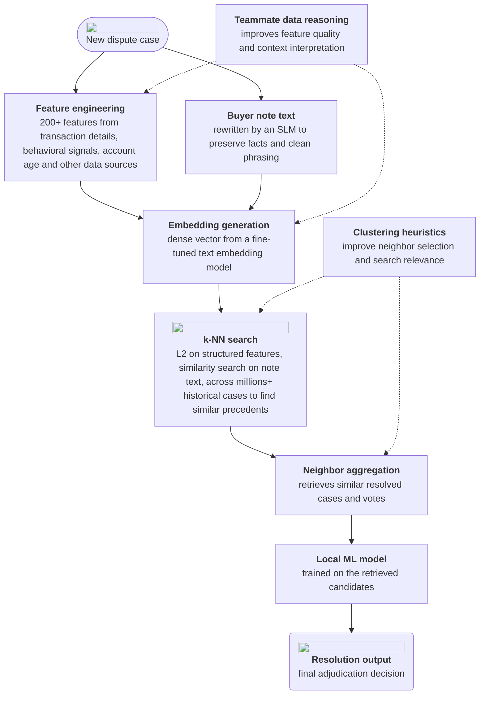
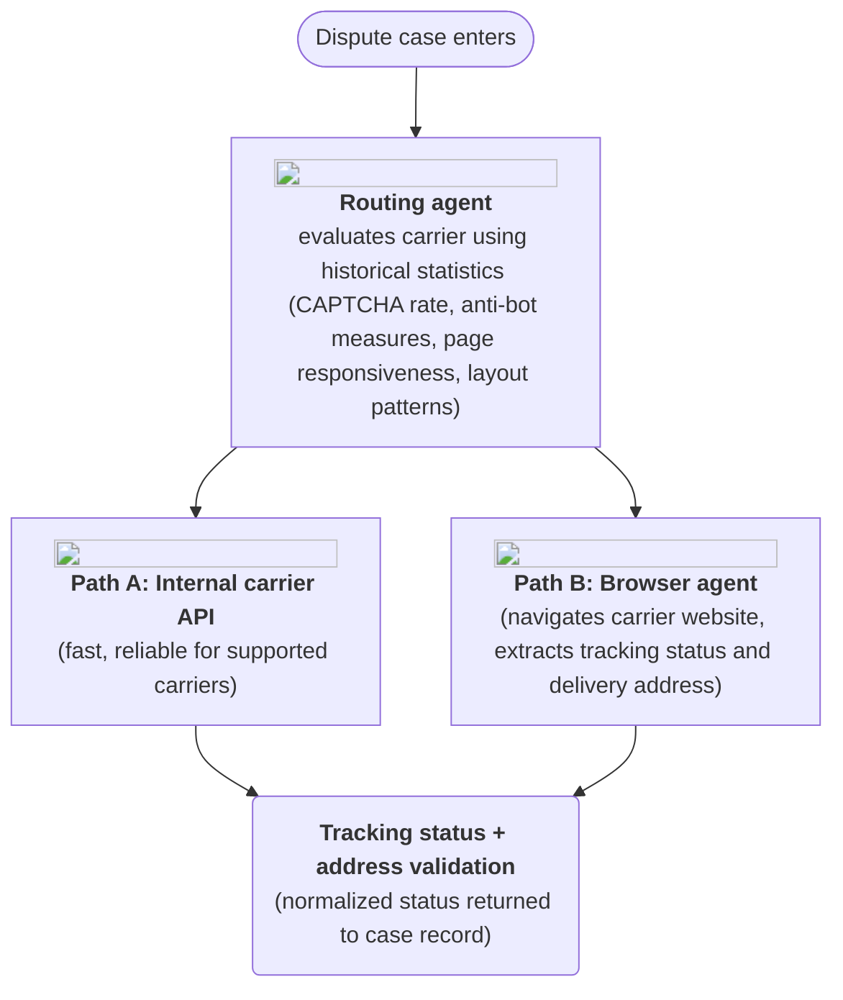

**Team:** PayPal ML engineering

**Period:** Summer 2026

## What I Worked On
I spent the summer working under the disputes domain, on large scale context retrieval & browser agents engineering

### Instant resolution context retrieval

**Goal:** When a new dispute comes in, we want to instantly recommend a resolution right away based on how similar cases were decided in the past. The 2 main types of dispute I dealt with were Item Not Received (INR) & Significantly Not As Described (SNAD).

I helped build a system that encodes each case as a embedding vector, then searches across historical resolved cases to find the closest matches. The adjudication decisions from those neighbors are aggregated to produce a resolution recommendation for the new dispute.

## Components:

**Case representation:** Each case combines two inputs.
The first is a set of 200+ engineered features drawn from transaction details, behavioral signals, account signals, etc.
Next, we also use the buyer free-text note, which is often noisy, with typos, and contain spam texts. I leveraged a Small Language Model (Gemma 3) to 1. rewrite each note to keep the facts and 2. filter buyer note text that do not provide concrete value

**Embedding generation:** Each case ends up with two vectors: a structured vector $q_s$ built from the engineered features, and a text embedding $q_t$ of the buyer note from a text embedding model.

**k-NN search:** Given a new case, we search across millions of historical resolved cases, using a different metric for each vector.
Structured features are matched by L2 distance:

$$d(q_s, x_s) = \lVert q_s - x_s \rVert_2 = \sqrt{\sum_{i} (q_{s,i} - x_{s,i})^2}$$

Buyer notes are matched by cosine similarity:

$$\text{sim}(q_t, x_t) = \frac{q_t \cdot x_t}{\lVert q_t \rVert \, \lVert x_t \rVert}$$

**Recency decay weighting:** To account for the fact that an older dispute may be less useful in adjudicating a new dispute, each retrieved neighbor $i$ has its similarity score decayed exponentially by the number of days since it was resolved, $\Delta t_i$:

$$\text{score}_i = \text{sim}_i \cdot e^{-\lambda \Delta t_i}$$

The decay rate $\lambda$ controls how quickly older disputes lose influence.

**In-context learning:** After retrieving the top $k$ candidates, I developed and trained an ensemble of classical ML models (LightGBM, XGB, etc) on the retrieved candidates to produce the final decision. This can be thought of as a test-time training/in-context learning approach.

**Improving retrieval quality:** I also researched and applied clustering heuristics on past teammate domain knowledge to refine which neighbors are selected and improve search relevance.

**Data engineering:** Due to the diversity of INR cases, they tend to contain many outliers, including high-risk disputes and disputes with unusually large amounts, which made them poor candidates for instant resolution.
Through analysis and ablation testing, I set a threshold on the score from an online model and used it to filter these disputes out before retrieval. This helped keep the candidate pool clean and representative of the disputes seen at test time.

**Metrics and impact:** The system reached 91%+ precision at an operating point of 12%+, while keeping the cost per case under \$6.
As a result, the improvements increased coverage of online cases by about 2.5x, reaching cases that the existing instant resolution solution could not handle.

### Agents for parcel case validation

**Goal:** Given a dispute case that relates to parcel shipping, we needed to validate the shipping address and determine the parcel's tracking status so we can provide more context for the review process.

The system uses several components:

**Routing agent:** I worked on a routing agent that decides how to fetch tracking status for a given case, choosing between an internal carrier API and the browser agent. The problem was that the API could not cover certain carriers, and the browser agent could not operate on some carriers, so both of them are needed for improved coverage.

To ensure routing works effectively, I proposed that we used historical dispute data to engineer and derive carrier statistics and heuristics (CAPTCHA occurrences, anti-bot measures, page responsiveness, page layouts, etc), to accurately route each case to the path that has worked most reliably for it.

**Tool orchestration:** When we route a case to the browser path, a browser tool use is orchestrated to navigate the carrier's site, read the tracking page, and extract the delivery status and address.

**Self-learning:** When a routing decision turns out to be wrong (for example, the chosen path fails to return a valid status), the wrong outcome is fed back into the routing agent so future routing improves without manual tuning.

**Metrics**: The system achieved an overall accuracy of 76%, with the capability to process up to 17k+ parcel shipping disputes weekly, greatly alleviating manual and repetitive work. Furthermore, this framework would be extended to other domains beyond disputes, which greatly strengthens its utility.
