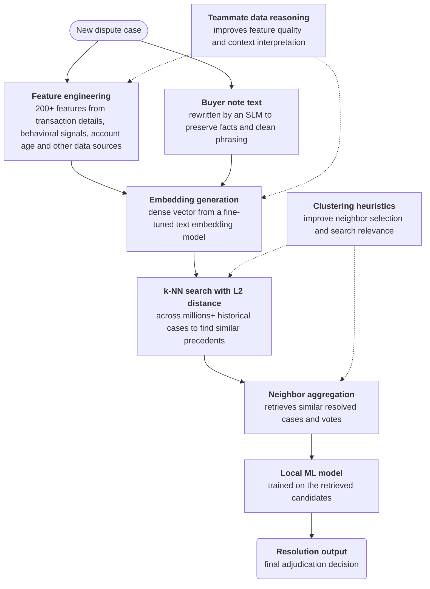
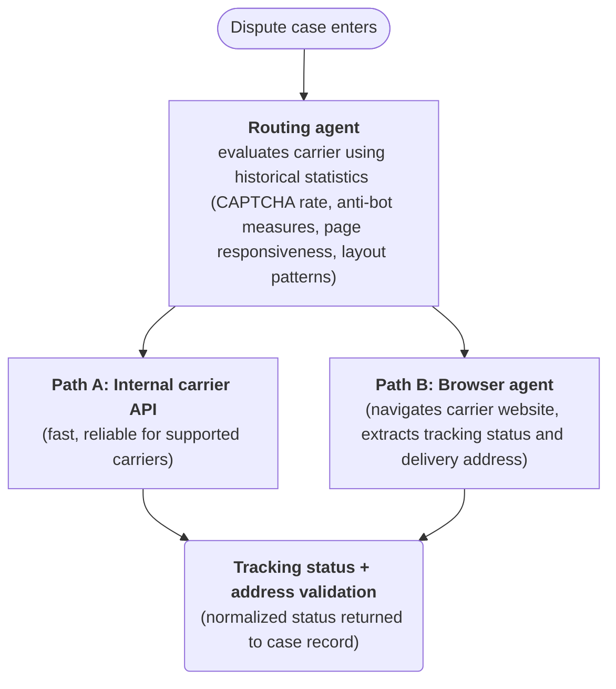

**Team:** PayPal ML engineering

**Period:** Summer 2026

## What I Worked On
Working in dispute domain, on large scale context retrieval & browser agents engineering

### Instant resolution context retrieval

### Agents for parcel case validation

**Goal:** Given a dispute case that relates to parcel shipping, we needed to validate the shipping address and determine the parcel's tracking status so we can provide more context for the review process.

The system uses several components:

**Routing agent:** I worked on a routing agent that decides how to fetch tracking status for a given case, choosing between an internal carrier API against the browser agent. The problem was that the API could not cover certain carriers, and the browser agent could not operate on some carriers, so both of them are needed for improved coverage 

To ensure routing works effectively, I proposed that we used historical dispute data to engineer and derive carrier statistics and heuristics (capcha occurances, anti-bot measures, page responsiveness, page layouts, etc), to accurately route each case to the path that has worked most reliably for it.

**Tool orchestration:** When each route a case to the browser path, a browser tool use is orchestrated to navigate the carrier's site, read the tracking page, and extract the delivery status and address.

**Self-learning:** When a routing decision turns out to be wrong (for example, the chosen path fails to return a valid status), the wrong outcome is fed back into the routing agent so future routing improves without manual tuning.

**Metrics**: The system achieved an overall accuracy of 76%, with the capability to process up to 17k+ parcel shipping disputes weekly, greatly alleviating manual and repetitive work. Furthermore, this framework would be extended to other domains beyond disputes, which greatly strengthens its utility.