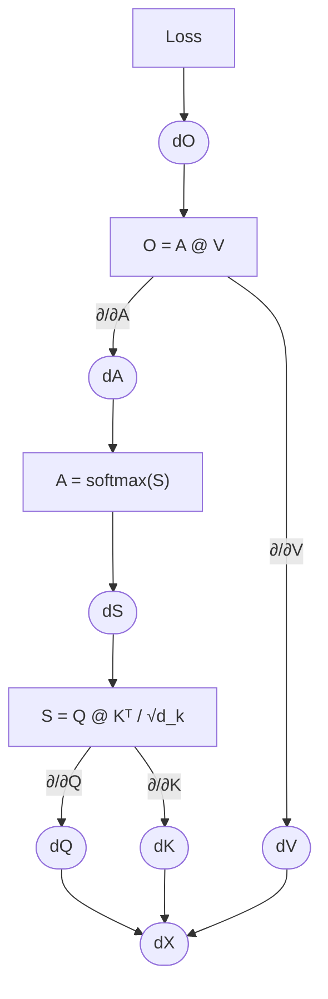

## Goal

Implement the attention backward pass & loss.

### Loss

Cross entropy is the negative log-likelihood of the **correct** token, averaged over positions:

$$
\mathcal{L} = -\frac{1}{N} \sum_{t=1}^{N} \log p_{t, y_t}, \qquad p_t = \mathrm{softmax}(z_t)
$$

where $z_t$ are the output logits and $y_t$ is the true next-token index.
The gradient at the logits is the clean starting point of the whole backward chain:

$$
\frac{\partial \mathcal{L}}{\partial z_t} = p_t - y_t
$$

with $y_t$ the one-hot true label.

### Forward & backward pass

```py
import numpy as np

def attn_forward(Q, K, V):
    d = Q.shape[-1]
    S = Q @ K.T / np.sqrt(d)
    S = S - S.max(-1, keepdims=True)
    P = np.exp(S); P /= P.sum(-1, keepdims=True)
    O = P @ V
    return O, P


# dO - gradient of loss w.r.t O

def attn_backward(dO, Q, K, V, P):
    d = Q.shape[-1]
    dV = P.T @ dO # since O = PV, then dP = dO @ V.T, dV = P.T @ dO
    dP = dO @ V.T
    dS = P * (dP - (dP * P).sum(-1, keepdims=True))
    dQ = dS @ K / np.sqrt(d)
    dK = dS.T @ Q / np.sqrt(d)
    return dQ, dK, dV
```

### Gradient visualization for attention

