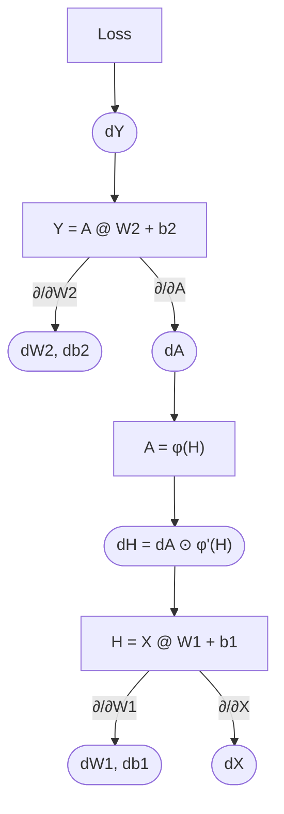

## Goal

Implement an MLP forward and backward pass.

### Setup

A two-layer MLP with a ReLU nonlinearity

### Forward & backward pass

```py
import numpy as np

def mlp_forward(X, W1, b1, W2, b2):
    H = X @ W1 + b1
    A = np.maximum(H, 0)          # RELU
    Y = A @ W2 + b2
    return Y, (X, H, A)


# dY - gradient of loss w.r.t Y (as above)

def mlp_backward(dY, cache, W1, W2):
    X, H, A = cache
    dW2 = A.T @ dY   # As we know Y = A @ W2 + b2, see Attention Backward Pass.md for similar idea
    db2 = dY.sum(0)
    dA = dY @ W2.T
    dH = dA * (H > 0)             # relu mask
    dW1 = X.T @ dH                # H = X W1 + b1
    db1 = dH.sum(0)
    dX = dH @ W1.T
    return dX, dW1, db1, dW2, db2
```

### 3 main patterns

| Forward op | Backward | Why |
| --- | --- | --- |
| matmul $Z = UV$ | `dU = dZ @ V.T`, `dV = U.T @ dZ` | contract over the shared axis |
| broadcast add (bias) | sum over the broadcast axis | one param used N times, gradients add |
| elementwise $f$ | multiply by $f'$ | local derivative |


### Gradient visualization

